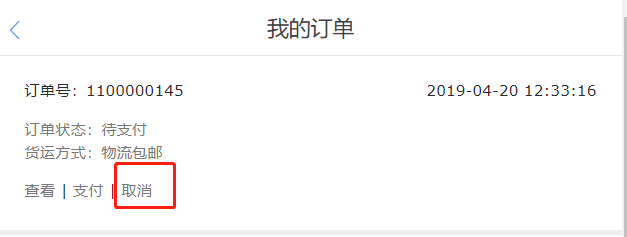
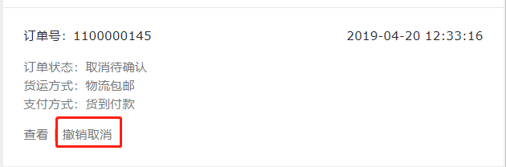
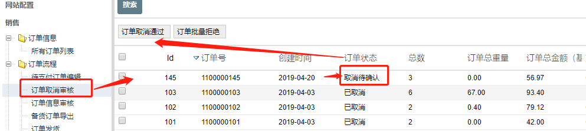
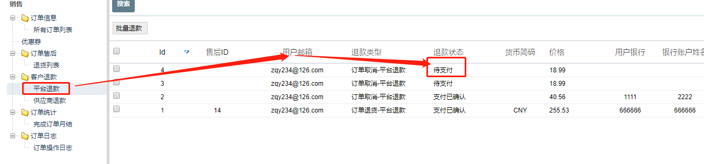

FecMall用户取消订单
==============

> 订单创建后，用户进行订单取消的操作

### 订单取消类型

`订单取消`分为2种:

1.用户直接发起订单取消请求后，不需要经销商确认，
`直接订单取消`成功

当订单创建，支付，以及审核失败失败等状态，
详细参看代码：

```
Yii::$service->order->info->orderStatusRedirectCancelArr = [
    Yii::$service->order->payment_status_pending,
    Yii::$service->order->payment_status_processing,
    Yii::$service->order->payment_status_canceled,
    Yii::$service->order->payment_no_need_status_confirmed,
    Yii::$service->order->payment_status_confirmed,
    Yii::$service->order->status_audit_fail,
]
```

2.订单取消发起后，需要`经销商`确认

当订单状态为：`订单审核通过`后，用户如果发起`订单取消`请求，需要
经销商审核，如果经销商没有发货，那么可以根据情况处理取消请求，
如果经销商发货或者不同意订单取消，那么可以驳回 `订单取消请求`

，

### 订单取消操作


用户可以在`账户中心`,
订单管理功能页面，点击`取消`按钮



1.如果订单可以`直接取消`，那么不需要经销商审核，也就是上面
`订单取消`类型的第一种,
提交后，`订单直接取消`，如果订单支付为在线支付，并且支付成功，那么会发生
订单`退款`，需要在后台进行`订单取消`退款（目前退款为`线下退款`）


2.如果订单取消发起后，需要经销商审核

2.1`订单取消`请求发起后，如果用户想撤回该`请求`，用户可以点击订单`撤销取消`请求，
来撤回该请求



2.2订单取消请求发起后，经销商在后台可以看到该请求



经销商勾选处理的`订单取消`请求，选择`订单取消通过`还是`订单取消拒绝`

如果点击的是`订单取消通过`，那么订单将会被`取消`，
如果订单支付为在线支付，那么会发生
`订单退款`


如果点击的是`订单取消拒绝`，那么`订单取消`请求将会被驳回,
订单将继续按照后续的处理流程继续处理。

3.其他

订单发货后，用户将不能发起`订单取消请求`

`订单取消请求`还没有审核的时候，订单无法进行其他处理（
也就是无法进行后续的订单发货操作），只能等
`订单取消审核`处理完成。

4.订单取消后
产品将会返还`库存`，
订单取消之后，代表订单终结，`订单取消`操作成功后，订单不可以进行其他的操作。

5.订单取消后，如果订单是在线支付（收款方为平台），
那么平台需要进行订单退款操作。



线下退款完成后，平台商在后台更改退款状态。


