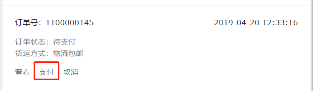
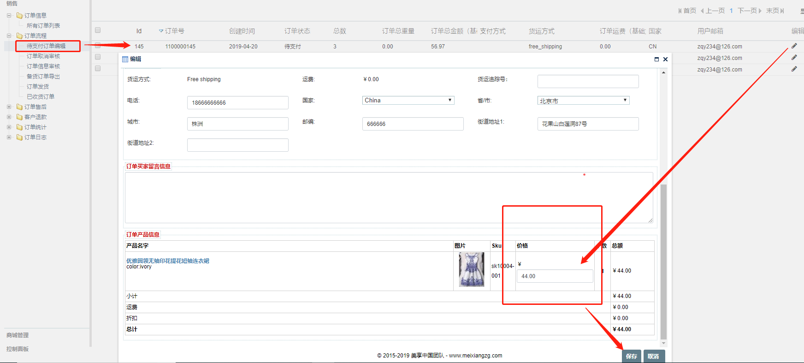

FecMall订单创建和支付
===============

> 用户创建订单，以及进行支付的过程

### 下单流程

1.用户选择产品加入购物车后，然后进行下订单操作，
填写货运地址，选择物流，进行下单

2.用户下单成功后，则进入支付页面，这个过程表示订单创建完成，但是还未支付

2.1如果用户回到首页，或者其他页面，可以进入账户中心的订单部分，点击支付按钮，进行支付

2.2订单未支付前，经销商可以在后台修改产品的价格，类似于淘宝产品拍下，
商家可以修改产品的价格，
这种方式一般用于用户和商家谈妥的一个价格进行支付

经销商修改订单价格后，用户进行订单的支付，支付后的订单，经销商
不能修改订单的价格。

3.订单支付：选择支付方式，进行订单的支付

3.1如果选择的是线上支付，提交后，则进入第三方在线支付页面，支付完成后，跳转回网站完成订单的支付
，进入订单完成页面。

3.2如果选择的是货到付款，提交后，则进入订单完成页面。

订单创建和支付流程完成

