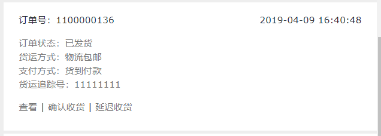

FecMall用户收货
==========

> 经销商发货后，用户收到商品后，进行订单收货确认操作


### 用户订单收货操作

当备货订单被`订单发货`后，用户在账户中心的订单
部分可以看到`订单发货`的信息，然后进行订单收货操作



当在一定时间内，用户没有收到货物，规定时间内快要数据的几天内，
会出现延迟收货按钮，用户可以点击延迟收货按钮延迟收货时间


### 订单状态变化

1.被操作的订单状态

```
// order_status
Yii::$service->order->info->orderStatusCanReceivedArr = [
    Yii::$service->order->status_dispatched,
]
// order_operate_status
Yii::$service->order->info->orderOperateStatusCanReceivedArr = [
    Yii::$service->order->operate_status_normal,
];
```

        
2.订单收货，详细代码参看函数

```
Yii::$service->order->process->receiveOrder($orderModel) 
```
发货后，进行订单状态的更改

### 延期收货

1.参数设置, 打开Yii::$service->order->process可以看到类变量

```
 // 延迟订单收货时间: 最大天数
    public $delayReceiveOrderMaxDays = 45;
    // 延迟订单收货时间: 单次操作的天数，也就是用户在前端点击延迟收货后, 一次性延迟的天数
    public $delayReceiveOrderDaysPerTime = 5;
    // 延迟订单收货时间: 订单收货到期日期 - 当前日期  <= x 天，  可以触发延迟收货操作，譬如
    // 譬如这里设置为3，当日期为3天后就要被系统自动化自动设置为收货的时候（3天后就要被强制收货），
    // 这个时候用户可以在前端账户中心订单列表，进行延迟收货操作。
    public $delayReceiveOrderTriggerDays = 3;
    // 订单收货最大间隔默认时间：订单发货后，超过x天，而且用户没有进行延迟订单收货操作，系统将自动将订单设置为订单已收货。
    public $orderDefaultMaxRecevieDay = 10;
```

您可以通过配置注入的方式修改这些参数（在service config中添加或者修改配置即可更改该类变量的配置值）


请仔细看上面的参数配置的注释内容

2.延迟收货函数

```
Yii::$service->order->process->delayReceiveOrder($orderModel)
```

延期收货后，如果订单没有收到，可以继续延期收货，直到
达到最大的时间，无法延期收货

超过最大时间，用户可以联系平台来解决。


