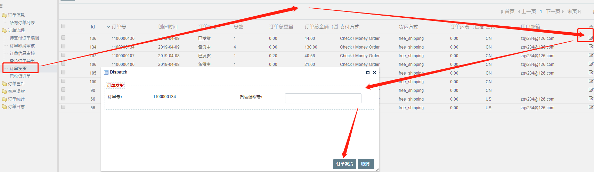

FecMall订单发货
==========

>订单审核通过后，经销商将订单信息导出，进行订单发货操作

### 订单发货

> `备货中`的订单可以进行`订单发货`操作

在弹框中填写物流追踪号，保存即可完成订单发货的操作

 

操作完成后，订单状态为已发货，用户在前端商城可以看到
订单的状态的变化。


### 订单状态变化

1.被操作的订单状态

```
// order_status
Yii::$service->order->info->orderStatusCanDispatchArr = [
    Yii::$service->order->status_processing,
]
// order_operate_status
Yii::$service->order->info->orderOperateStatusCanDispatchArr = [
    Yii::$service->order->operate_status_normal,
];
```

2.订单发货，详细代码参看函数

```
Yii::$service->order->process->dispatchOrder($orderModel, $tracking_number) 
```
发货后，进行订单状态的更改


