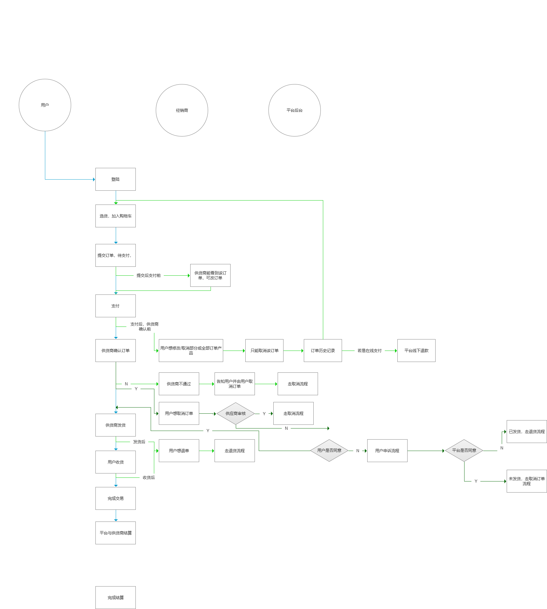

FecMall订单处理流程
============

> 对于多商户电商，订单处理是比较麻烦的一个流程部分，该部分对订单
的订单处理流程进行了讲解

### 订单流程图

下面是订单处理的流程图部分，如果看不清可以放到浏览器来阅读该
图片的内容，下面是一个完整的订单处理流程。

### 订单状态

对于FecMall多商户版的订单状态，在数据库中用了两个字段来标识
`order_status`和 `order_operate_status`

1.`order_status`作为订单处理的流水线状态记录，
譬如订单创建，支付，审核，发货，收货等

2.`order_operate_status`作为订单处理过程中终端或者挂起等状态的标识，
譬如订单取消审核中，订单已取消等等

3.订单的状态在`@fbbcbase/services/Order.php`的类变量中

4.支持货到付款类型

