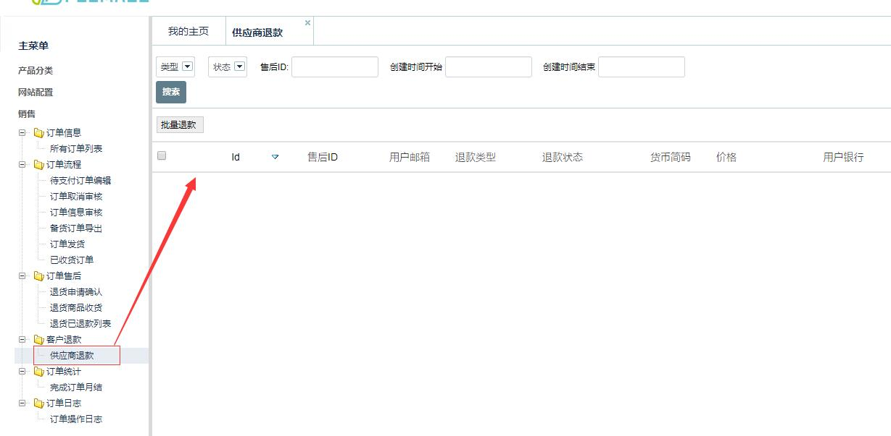
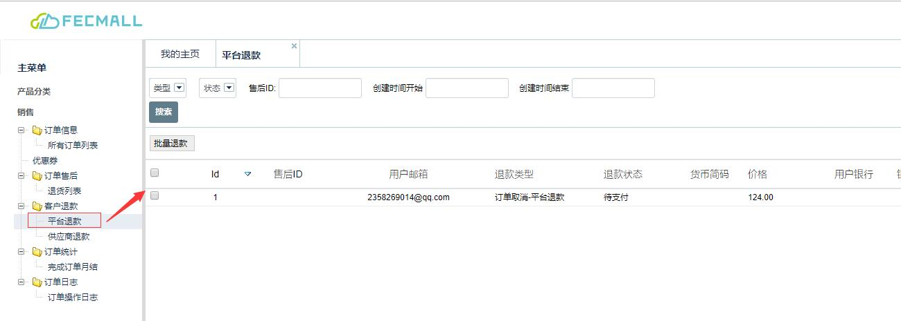
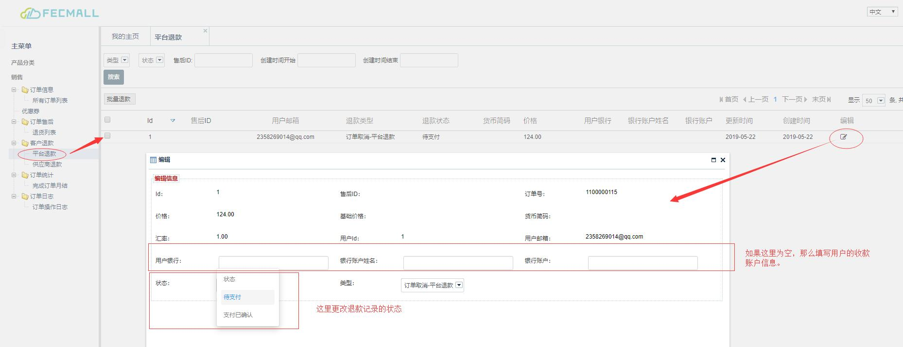

FecMall订单退款介绍
================

> Fecmall用户创建的订单，需要退款的各种情况的介绍

### 退款类型

`订单取消退款`: 当订单创建后，在线支付成功，平台收款完成后，如果用户进行订单
取消操作，通过后，将会进行订单取消退款，由平台进行退款操作（因为订单的钱由平台收取）

`售后退货退款-在线支付类型`：如果订单是`在线支付`，那么由`平台收款`, 
那么当用户发起`订单退货`后，退货产品对应的退款金额，由平台进行退款

`售后退货退款-货到付款类型`：如果订单是`货到付款`，那么由`经销商收款`, 
那么当用户发起`订单退货`后，退货产品对应的退款金额，由`经销商`进行退款

### 退款查看

经销商后台查看：推销商的退款记录：（经销商只能看到自己的退款信息）

平台商后台查看退款记录：（平台商后台可以看到经销商和平台的退款信息）

### 退款操作

目前的退款是线下进行的退款，也就是通过线下打款的方式，退回退款，然后在后台添加退款的账户，更改退款记录状态，
如图：

然后保存即可。

